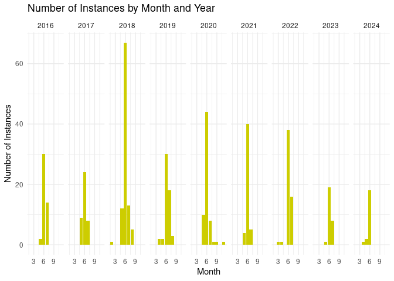

Final Markdown Report - Fireflies
================
Luke Hatch
2025-12-02

- [ABSTRACT](#abstract)
- [BACKGROUND](#background)
  - [Question](#question)
  - [Hypothesis](#hypothesis)
  - [Prediction](#prediction)
- [Methods and Results](#methods-and-results)
  - [1st Analysis (Bar Plot)](#1st-analysis-bar-plot)
  - [2nd Analysis (Scatter Plot)](#2nd-analysis-scatter-plot)
  - [3rd Analysis (Linear Model)](#3rd-analysis-linear-model)
- [DISCUSSION](#discussion)
  - [Interpretation of Analysis 1 (Bar
    Plot)](#interpretation-of-analysis-1-bar-plot)
  - [Interpretation of Analysis 2 (Scatter
    Plot)](#interpretation-of-analysis-2-scatter-plot)
  - [Interpretation of Analysis 3 (Linear
    Model)](#interpretation-of-analysis-3-linear-model)
- [CONCLUSION](#conclusion)
- [REFERENCES](#references)

# ABSTRACT

Firefly emergence is influenced by many environmental factors, including
temperature. This raises the question as to whether warming temperatures
(e.g. from climate change) could affect at what times of year adults are
observed. From citizen science data (provided by Christy Bills, 2025)
collected in Utah from 2016-2024 as part of the Western Firefly Project
(2025), we analyzed firefly observations monthly from year to year by
consolidating the observations into counts. We then displayed the data
patterns using a bar plot and a scatter plot. This displayed a
consistent peak firefly count in June each year with a slight downward
trend in earlier emergence. A linear model was ran in order to test for
both the trend and significance between the peak observational counts in
2016-2024, yielding insignificant results (p = 0.309). These results did
not support our hypothesis of warmer temperatures affecting the timing
of firefly emergence. However, citizen science data is limiting and
long-term observational studies in various locations could yield other
results.

# BACKGROUND

Fireflies are among the most mesmerizing insects in the world due to
their unique glow in the night sky. Most people would run to avoid
insects, but for these they stop and watch. In some cases, they even
record what they saw, providing firefly citizen scientist data that
supports further research on their behavior. Before they’re in the sky,
however, they spend the majority of their lives underground developing.
Duration of their lives underground is influenced by a variety of
factors (Evans et al., 2019). Depending primarily on climate and soil
conditions, the stages of the firefly life cycles can be altered -
taking or adding time (Evans et al., 2019). Because these conditions
change each year, the timing and number of emerged fireflies can also
fluctuate. This report uses citizen science data collected in Utah to
examine firefly observational counts over the past 9 years and how the
timing of those counts has changed.

## Question

How has the timing of firefly peak observational count changed over the
last 9 years (2016-2024)?

## Hypothesis

Due to temperature changes (e.g. global warming), fireflies are expected
to emerge sooner in the year as each year passes, as warmer temperatures
can accelerate their development and affect the timing of emergence
(indicated by peak observational counts)(Evans et al., 2019).

## Prediction

If temperature increases have influenced firefly emergence, then peak
observational counts would be observed earlier in years where the
temperature is higher earlier in that year (such as emerging in May
vs. June).

# Methods and Results

Over the years, starting in 1964, citizen science data was collected
throughout Utah on firefly sightings. Observations included information
like date, time, location, habitat, and count was recorded. This data
was used to answer our question regarding observational counts year to
year and whether there was an earlier trend of emergence or not. Citizen
science data is notoriously messy and unreliable, so we took the data
and simplified it by only using the dates observed and using that date
as a count, rather than the numbers of fireflies reported. We also added
a column that converted the day of the year to a Julian calendar day. We
made this change to the response variable for simplicity comparing year
to year, numbering each day 1-365 rather than 1-30 repeated for each
month. This revised data was then uploaded to R Studio Cloud and code
was written to: 1) display the data by counts per month each year in a
multi-plot 2) display the data year-to-year by peak observational counts
and observe the trend and 3) create an linear model to determine if the
trend is significant.

## 1st Analysis (Bar Plot)

``` r
data <-read.csv("UtahFirefly.csv")

#create a barplot that displays counts in each month, each year
ggplot(data, aes(x= Month))+
  geom_bar(fill = "steelblue3") +
  facet_grid(~ Year) +
  labs(title = "Number of Instances by Month and Year", 
       x = "Month", 
       y = "Number of Instances") +
  theme_minimal()
```

<!-- -->

## 2nd Analysis (Scatter Plot)

``` r
# make plot of Max Julian day
table_Julian <- table(data$Year, data$Julian)
# find the max count each year
max_col <- apply(table_Julian, 1, which.max)
# create a data frame with year and max Julian day
Julian <- as.numeric(colnames(table_Julian)[max_col])
Year <- c(2016, 2017, 2018, 2019, 2020, 2021, 2022, 2023, 2024)
# Create a color gradient
color_gradient <- colorRampPalette(c("steelblue1", "steelblue4"))
# Generate a vector (color gradient) based on Julian values
cols <- color_gradient(100)[as.numeric(cut(Julian, breaks = 100))]
#plot as scatter plot
plot(Year, Julian, main = "Scatter Plot of Peak Observation Counts Each Year",
     col = cols,
     pch = 19,       # filled circles
     cex = 1.5,      # point size
     ylab = "Julian Day")
# add a linear regression trendline
abline(lm(Julian ~ Year), col = "blue", lwd = 2, lty = 2)
```

<!-- -->

## 3rd Analysis (Linear Model)

``` r
#create data frame 
Julian_dataframe <- data.frame(ColumnA = Julian, ColumnB = Year)
m1 <- lm( ColumnA ~ ColumnB, data=Julian_dataframe)
# run linear model from julian data frame for slope and p value
summary(m1)
```

    ## 
    ## Call:
    ## lm(formula = ColumnA ~ ColumnB, data = Julian_dataframe)
    ## 
    ## Residuals:
    ##     Min      1Q  Median      3Q     Max 
    ## -18.278  -2.778  -1.778   7.222  16.222 
    ## 
    ## Coefficients:
    ##             Estimate Std. Error t value Pr(>|t|)
    ## (Intercept) 3192.778   2764.342   1.155    0.286
    ## ColumnB       -1.500      1.368  -1.096    0.309
    ## 
    ## Residual standard error: 10.6 on 7 degrees of freedom
    ## Multiple R-squared:  0.1465, Adjusted R-squared:  0.02456 
    ## F-statistic: 1.201 on 1 and 7 DF,  p-value: 0.3093

# DISCUSSION

Results of citizen science firefly observations did not show a
significant change in peak observational counts each year. Analyses
showed each observation on a timeline from 2016 to 2024. It was clear
that firefly emergence was highest around June each year. In taking a
closer look at the peak counts each year, there was a slight trend
downward as the years became more current. After the linear model was
examined, the slope of this line was determined to be -1.5 and the
significance of the peak observational counts was 0.3093. This meant the
change year to year was not significant. This did not support our
hypothesis.

## Interpretation of Analysis 1 (Bar Plot)

The bar plot clearly shows a common trend of firefly observational
counts each year. Counts start lowest in the beginning of the year, and
around June (Julian days 145-190) peak in numbers. This is followed by a
decline as the year completes and the cycle repeats.

## Interpretation of Analysis 2 (Scatter Plot)

This scatter plot is a visual of the peak observational counts from
years 2016-2024. There is a large amount of fluctuation in the time of
year peaks counts are reached each year, with the latest outlier in 2016
with the earliest peak observation count following in 2017. The
contributes to a slight downward trend as the years go by, but does not
indicate the slope of that line or significance (see Analysis 3 below).

## Interpretation of Analysis 3 (Linear Model)

The results of the linear model display both the slope of the scatter
plot from analysis 2 as well as the test for significance. The slope was
-1.5, indicating a slight downward trend. However the p-value was 0.309,
indicating the change over time was not significant. The adjusted
R-squared value supports this conclusion of no significance with a value
of 0.025.

# CONCLUSION

In determining whether the timing of firefly counts was changing
year-to-year, the results were not significant (p-value = 0.309). This
value indicates there is no detectable shift in peak observation count
timing (emergence) over these years. Overall, the data did not support
our hypothesis that warmer temperatures each year contribute to an
earlier firefly emergence. This suggests that firefly counts are
currently remaining relatively consistent from year to year. A major
limitation of this study is the source of the data - citizen science
contributions. Although usable, citizen science data can be unreliable
in consistency and accuracy. This also contributed to the timescale for
the observations. Due to the inconsistency of observations, we limited
the analysis to only the years 2016-2024 as they appeared the most
complete and consistent. With more consistent data (i.e. more data from
the 1900s), the observed trend in the 9 years examined could be more
significant. Further research could involve a long-term study with more
reliable data to test for significance. Evans et. al (2019) has already
demonstrated the connection of firefly emergence with temperature
changes, thus further study in temperature changes year to year would
also be important in determining temperature as the most likely concern
for potential future emergence timing changes. Studying firefly
populations in other locations outside of Utah may show a similar trend
or no trend at all, furthering research on whether this is a world-wide
possibility.

# REFERENCES

1.  Bills, C. (2025, September 25). Citizen Science. Utah State
    University.

2.  Evans, D. M., Boyer, A. G., Phillips, M. L., & Jepsen, S. J. (2019).
    Firefly (Coleoptera: Lampyridae) phenology, life history, and
    habitat associations in the western United States. Environmental
    Entomology, 48(2), 265–273. <https://doi.org/10.1111/een.12702>

3.  ChatGPT. OpenAI, version Nov 2025. Used as a reference for functions
    such as plot() and to correct syntax errors. Accessed 2025-12-02.

4.  Western Firefly Project: A Community Science Initiative \| Natural
    History Museum of Utah. (2025, October 18).
    <https://nhmu.utah.edu/citizen-science/fireflies>
